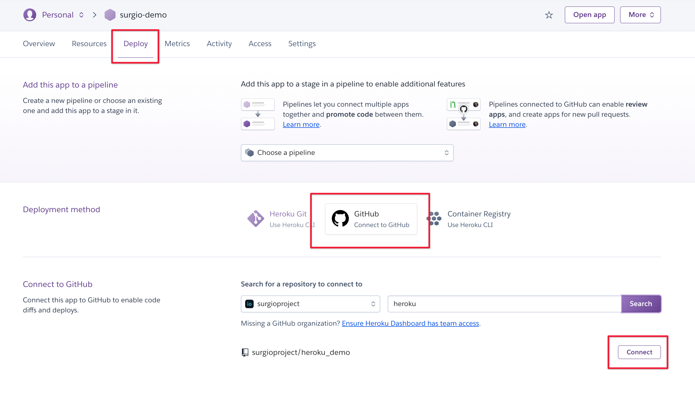

# 参与测试新版托管 API

## 安装新的网关组件

规则仓库目录内运行：

```bash
npm i @surgio/gateway@latest
```

同时需要保证 Surgio 版本号大于 v1.15.0。

## 修改 now.json

```json
{
  "version": 2,
  "public": false,
  "builds": [
    { 
      "src": "/gateway.js",
      "use": "@now/node",
      "config": {
        "includeFiles": [
          "provider/**",
          "template/**",
          "*.js",
          "*.json"
        ]
      }
    }
  ],
  "routes": [
    {
      "src": "/(.*)",
      "dest": "/gateway.js"
    }
  ]
}
```

## 修改 gateway.js

```js
'use strict';

const gateway = require('@surgio/gateway');

module.exports = gateway.createHttpServer();
```

## 部署

修改完后即可部署。由于是测试版，所以请不要在日常使用的域名下部署。为了安全起见请开启鉴权。

欢迎在交流群内汇报问题！

## 新增功能

### 1. Artifact 分类

Artifact 配置新增分类，方便在面板中找到想要的 Artifact。Surgio 内置了一些常用的类型，并且还为内置分类增加了个性化的功能。

`categories` 接受一个数组，数组内容可以自定也可以使用内置字段。

```js
const { categories } = require('surgio');

module.exports = {
  artifacts: [
    {
      name: 'SurgeV3.conf',
      template: 'surge_v3',
      provider: 'demo',
      categories: [
        'Maying',
        categories.SURGE,
      ],
    },
    {
      name: 'Surge.conf',
      template: 'surge',
      provider: 'demo',
      categories: [
        categories.SURGE,
      ],
    }
  ],
};
```

以下是所有的内置分类字段：

- `categories.SNIPPET` - 片段
- `categories.SURGE` - Surge
- `categories.QUANTUMULT_X` - Quantumult X 完整配置
- `categories.QUANTUMULT_X_SERVER` - Remote Server 片段
- `categories.QUANTUMULT_X_FILTER` - Remote Filter 片段
- `categories.QUANTUMULT_X_REWRITE` - Remote Rewrite 片段
- `categories.CLASH` - 完整 Clash 配置

### 2. 全新面板

### 3. 自有服务器部署

```js
// gateway.js

'use strict';

const gateway = require('@surgio/gateway');

(async () => {
  const app = await gateway.bootstrapServer();
  await app.listen(3000, '0.0.0.0');
  console.log('> Your app is ready at http://0.0.0.0:3000');
})();
```

```bash
node gateway.js
```

### 4. 获取配置文件接口支持自定义 URL 参数

URL 中的 Query 参数能够传入到模板变量 `customParams` 中，方便用户拓展模板。

比如：

```
https://example.now.sh/get-artifact/Surge.conf?access_token=token&foo=bar
```

那模板变量 `customParams.foo` 值为 `bar`。如果已经在 Artifact 中定义了这个 Key，那预先定义的值将被覆盖。

:::warning 注意
1. URL 参数中的值的类型都是字符串，形如 `true`、`1` 这样的值在模板中是 `"true"` 和 `"1"`；
2. `access_token`, `format`, `filter`, `dl` 为保留 Key 无法被定义；
:::

### 5. Heroku 部署

你可以在 [这里](https://github.com/surgioproject/heroku_demo) 找到完整的运行 Demo。

把你的规则仓库同步至 GitHub 后，到 Heroku 关联该项目。



关联项目后，开启 `master` 分支自动部署。你可以不开启这一项，后续如果需要更新服务代码则进行手动更新。


最后，手动触发一次部署。


你可能还需要更新 _surgio.conf.js_ 内 `urlBase` 的值。以这个 Demo 为例，它应该是：

```
https://surgio-demo.herokuapp.com/get-artifact/
```

:::tip 提示
Heroku 今后会和 now.sh 一样成为推荐的部署网关平台。
:::

### 6. 直接导出 Provider

有时候你只想将 Provider 导出成类似 Surge Policy 或者其它格式的配置，那么可以借助这个功能快速达到目的，免去了新建一个 Artifact 的麻烦。即使这个 Provider 没有被任何一个 Artifact 使用，它也是能够被直接导出的！


你可以在面板的 Provider 页面找到复制链接按钮。目前面板还不支持复制组装多个 Provider 的 URL。如果你想组装多个 Provider，可以修改 URL 中的 `providers` 参数，多个 Provider 名称以逗号分隔，例如：

```
https://example.com/export-providers?providers=maying,dlercloud&format=surge-policy
```