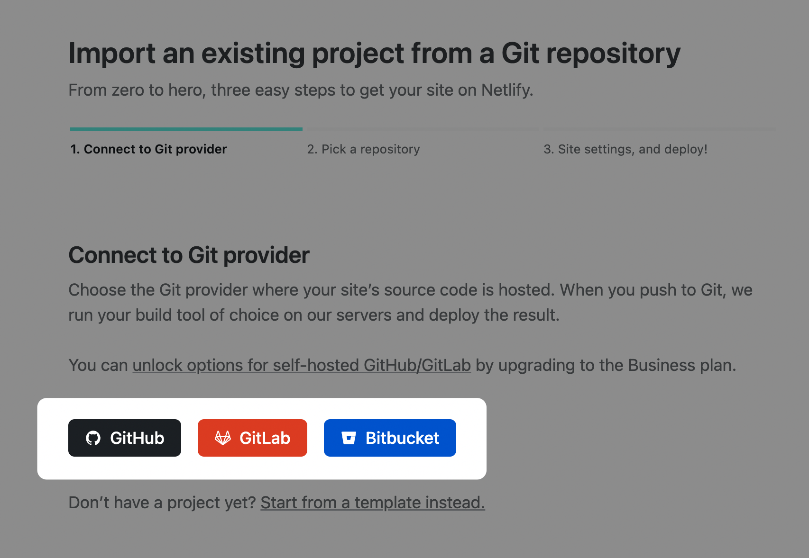
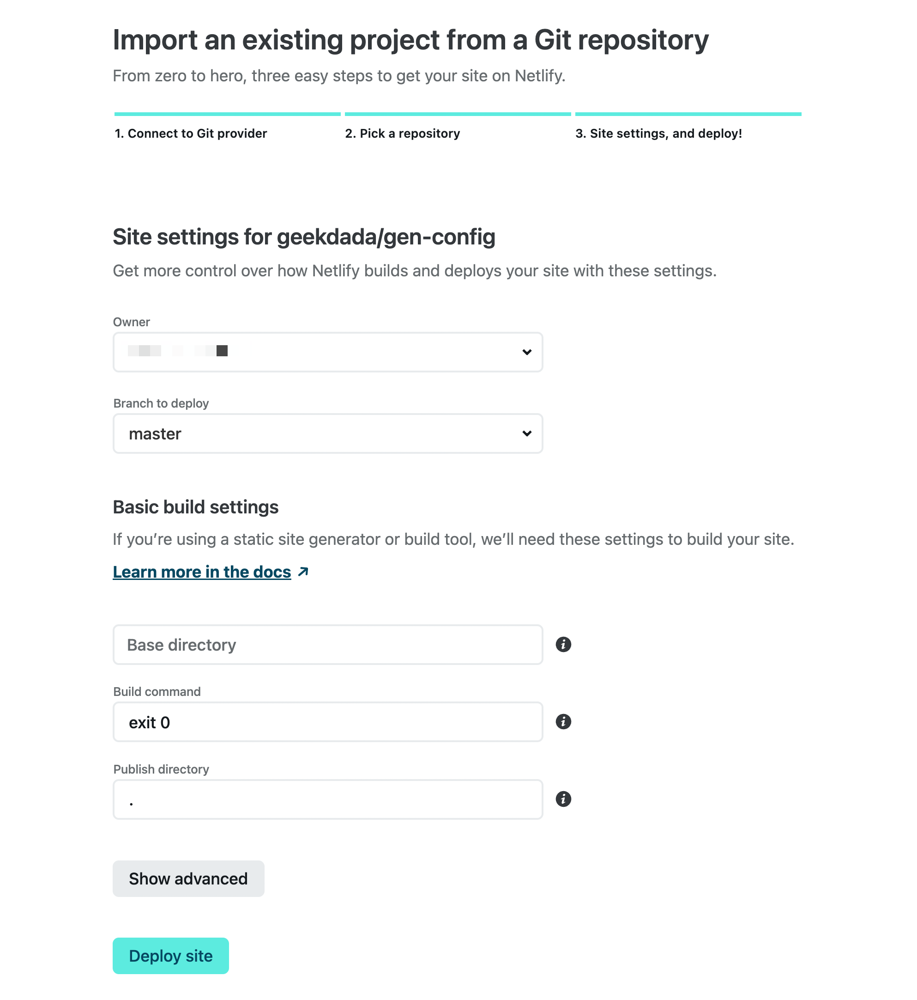
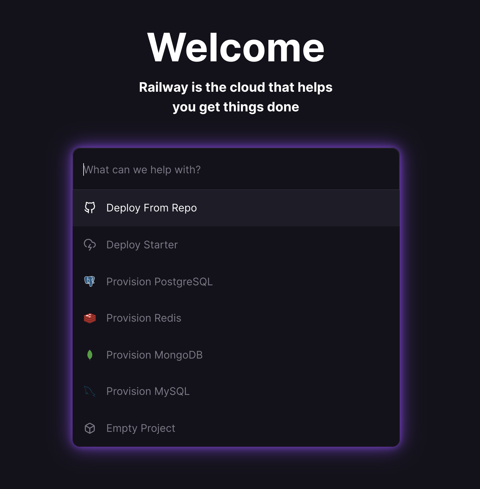
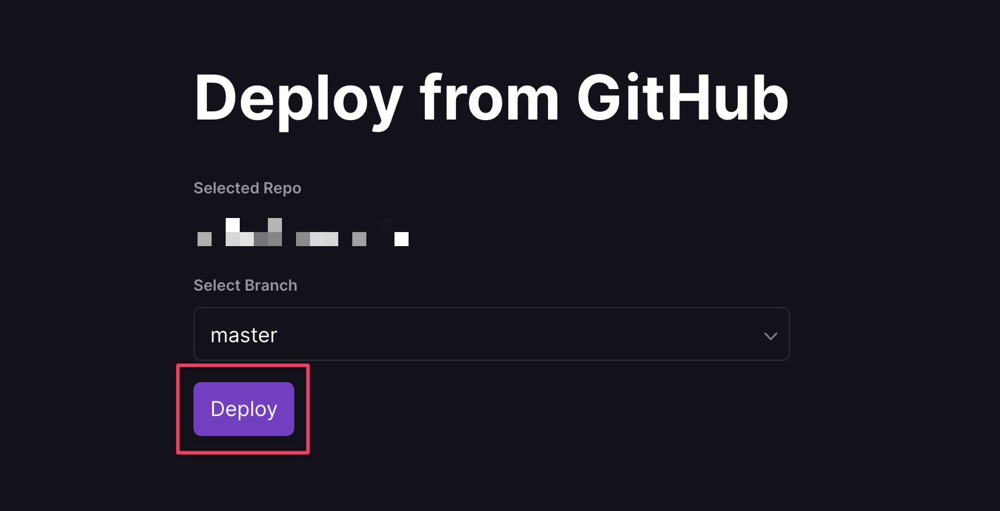
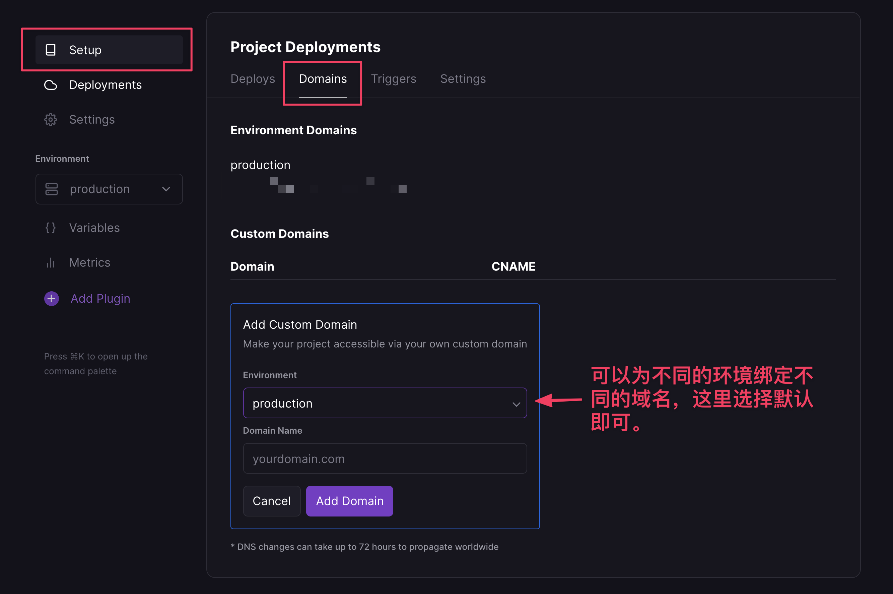
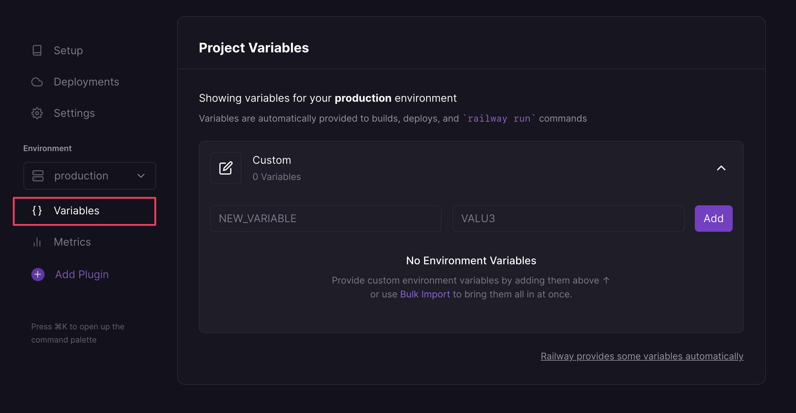

# 快速搭建托管 API

[[toc]]

## 前言

相信很多人都用过网络上处理规则的 API 接口，也有人在使用过 Surgio 后觉得更新规则不太灵活。虽然我们已经能够通过自动化的方法每隔一段时间更新一次规则，但还是无法做到实时更新。这篇文章就是想教大家，利用现成的 SAAS(Software as a Service) 服务，来实现一个 Surgio 规则仓库的 API。

目前 Surgio 支持两个部署平台，Vercel（推荐）和 Heroku。你也可以部署在自己的主机上，不过没有技术支持。

需要保证 Surgio 版本号大于 `v1.20.0`。

## 部署 - Netlify Functions

:::tip 提示
1. 该方法不要求代码托管平台，可为私有仓库（文章以 GitHub 为例）
2. 已经部署其它平台的仓库可以修改之后增加部署到 Netlify Functions，互不影响
:::

### 准备

确保 `surgio` 升级至 `v2.17.0` 或以上; `@surgio/gateway` 升级至 `v1.5.0` 或以上。

#### 开启接口鉴权

:::warning 注意
不建议关闭鉴权！
:::

请阅读 [这里](/guide/api.md#打开鉴权)。

#### 增加平台配置

在代码库根目录新建文件 `netlify.toml`，内容如下：

```toml
[build]
  command = "exit 0"
  functions = "netlify/functions"
  publish = "."

[functions]
  included_files = [
    "provider/**",
    "template/**",
    "*.js",
    "*.json"
  ]

[[redirects]]
  from = "/*"
  to = "/.netlify/functions/index"
  status = 200
  force = true
```

在代码库根目录新建目录 `netlify/functions` 并新建文件 `netlify/functions/index.js`，内容如下：

```js
'use strict';

const gateway = require('@surgio/gateway');

module.exports.handler = gateway.createLambdaHandler();
```

将修改 push 到代码库。

### 部署

在 Netlify 中选择新建项目，并选择代码库平台。



授权成功之后即可选择代码库，然后会看到如下的页面：



点击 __Deploy site__ 按钮，即可部署。

### 配置 Redis 缓存

:::tip 此步骤可选，推荐配置

[教程](/guide/advance/redis-cache.md)
:::

### 查看用量

你可以在账户的 Billing 页面查询当月的用量。

### 使用

你可能还需要更新 _surgio.conf.js_ 内 `urlBase` 的值，它应该类似：

```
https://surgio-demo.netlify.app/get-artifact/
```

:::tip 移步至
[托管 API 的功能介绍](/guide/api.md)
:::

## 部署 - Railway

:::tip 提示
1. 该方法要求代码仓库由 GitHub 托管，可为私有仓库
2. 已经部署 Vercel 的项目可以经过简单修改部署至 Railway
3. 已经部署 Heroku 的项目可以直接部署至 Railway
:::

### 准备

确保 `surgio` 升级至 `v2.17.0` 或以上; `@surgio/gateway` 升级至 `v1.5.0` 或以上。

#### 开启接口鉴权

:::warning 注意
不建议关闭鉴权！
:::

请阅读 [这里](/guide/api.md#打开鉴权)。

#### 增加平台配置

在代码库的根目录新建文件 `Procfile`，内容如下：

```
web: npm start
```

继续新建文件 `gateway.js`，内容如下：

```js
const gateway = require('@surgio/gateway')
const PORT = process.env.PORT || 3000

;(async () => {
  const app = await gateway.bootstrapServer()
  await app.listen(PORT, '0.0.0.0')
  console.log('> Your app is ready at http://0.0.0.0:' + PORT)
})()
```

参照 [这里](https://github.com/surgioproject/heroku_demo/blob/master/package.json) 在 `scripts` 下补充 `start` 脚本。

```json
{
   "start": "node gateway.js"
}
```

前往 [Railway.app](https://railway.app?referralCode=tN8cxr) 注册账号，可以不绑定信用卡。

### 新建项目

打开 [Railway.app](https://railway.app?referralCode=tN8cxr)，在 Dashboard 中选择新建项目。


选择从代码仓库部署。



随后在项目列表中找到代码库，选择用于部署的分支，点击部署。部署成功后即可使用默认分配的域名访问 Surgio 面板。

今后代码库的分支有更新 Railway 会自动拉取并部署。和 Vercel 不同的是，Railway 属于容器化方案，因此打包编译的时间会比 Vercel 久很多。



:::tip 不要忘记！
请不要忘记将 `surgio.conf.js` 中 `urlBase` 改为 Railway 的域名路径。
:::

### 配置项目

下面的内容属于自定义范畴，可跳过。如果你没有一定基础建议跳过。

#### 自定义域名



#### 修改环境变量

需要注意的是，每次增删环境变量都会触发打包编译，如果一次性要添加很多环境变量建议使用 **Bulk Import**。



### 配置 Redis 缓存

:::tip 此步骤可选，推荐配置

[教程](/guide/advance/redis-cache.md)
:::

### 查看用量

Railway 每月有 5 刀的免费用量，足够单个 Surgio 项目使用。你可以在 [这里](https://railway.app/account/billing) 查看本月的用量。

### 使用

你可能还需要更新 _surgio.conf.js_ 内 `urlBase` 的值，它应该类似：

```
https://surgio-demo.railway.app/get-artifact/
```

:::tip 移步至
[托管 API 的功能介绍](/guide/api.md)
:::

## 部署 - Heroku

你可以在 [这里](https://github.com/surgioproject/heroku_demo) 找到完整的运行 Demo。

把你的规则仓库同步至 GitHub 后，到 Heroku 关联该项目。


关联项目后，开启 `master` 分支自动部署。你可以不开启这一项，后续如果需要更新服务代码则进行手动更新。


最后，手动触发一次部署。


你可能还需要更新 _surgio.conf.js_ 内 `urlBase` 的值。以这个 Demo 为例，它应该是：

```
https://surgio-demo.herokuapp.com/get-artifact/
```

## 部署 - 自有服务器

新建文件 `gateway.js`，内容如下：

```js
const gateway = require('@surgio/gateway')
const PORT = process.env.PORT || 3000

;(async () => {
   const app = await gateway.bootstrapServer()
   await app.listen(PORT, '0.0.0.0')
   console.log('> Your app is ready at http://0.0.0.0:' + PORT)
})()
```

```bash
node gateway.js
```

## 部署 - Vercel

:::warning 警告
由于 Surgio 违反 Vercel [合理使用条款](https://vercel.com/docs/concepts/limits/fair-use-policy#never-fair-use) 中「服务不可用于 Proxies and VPNs」的规定，将 Surgio 部署至 Vercel 可能引起账号封禁。
:::

### 准备

1. 注册一个 [Vercel](https://vercel.com) 账号
2. 可以不绑定付款方式

### 配置

首先，安装工具链。

```bash
$ npm i -g vercel
```

在项目中安装 `@surgio/gateway`。

```bash
$ npm i @surgio/gateway --save
```

:::tip 提示
之前已经使用了测试版的朋友请使用下面的命令升级到正式版。

```bash
$ npm i @surgio/gateway@latest --save
```
:::

登录账号。

```bash
$ vercel login
```

新建文件 `vercel.json`。

```json
{
  "version": 2,
  "public": false,
  "builds": [
    { 
      "src": "/gateway.js",
      "use": "@vercel/node",
      "config": {
        "includeFiles": [
          "provider/**",
          "template/**",
           "node_modules/@surgio/gateway-frontend/**",
          "*.js",
          "*.json"
        ]
      }
    }
  ],
  "routes": [
    {
      "src": "/(.*)",
      "dest": "/gateway.js"
    }
  ]
}
```

在 `package.json` 中增加如下字段：

```json
{
  "engines": {
    "node": ">=14"
  }
}
```

### 编写云函数

新建文件 `gateway.js`。

```js
'use strict';

const gateway = require('@surgio/gateway');

module.exports = gateway.createHttpServer();
```

### 配置

#### 接口鉴权

:::warning 注意
不建议关闭鉴权！
:::

在 `surgio.conf.js` 中增加如下字段：

```js
module.exports = {
  gateway: {
    auth: true,
    accessToken: 'YOUR_PASSWORD',
  },
}
```

:::tip 提示
1. 完整的 gateway 配置可以在 [这里](/guide/custom-config.md#gateway) 查看。
2. 对于已经部署了托管接口的用户，推荐不要第一时间打开鉴权功能，而是配置 `accessToken` 一段时间后再将 `auth` 改为 `true`。这样可以让已经下载过旧托管文件的客户端更新到新的包含有 `access_token` 参数的托管文件。
:::

### 部署

```bash
$ vercel --prod
```

如果不出意外你会看到如图的信息，高亮的 URL 即为云函数服务的访问地址。

 

为了让托管地址保持一致，你需要到 `surgio.conf.js` 把 `urlBase` 更新为：

```
https://xxxxxx.xxx.vercel.app/get-artifact/
```

最后，再运行一次

```bash
$ vercel --prod
```

更新服务。

### 使用

:::tip 移步至
[托管 API 的功能介绍](/guide/api.md)
:::

### 最后

有几点需要大家注意的：

1. 每一次更新本地的代码，都需要执行一次 `vercel`，保证远端和本地代码一致；
2. 访问日志、监控、域名绑定等复杂功能恕不提供教程；
3. 如果访问地址泄漏，请立即删除云函数然后修改机场密码；
4. 由于免费用户单次请求的超时时间为 10s，所以不建议使用过多的远程片段、较高的超时时间和重试机制。若你为付费用户，可以在 `vercel.json` 中加入以下的环境变量增加网络重试次数和超时时间。

   ```json
   {
     "env": {
       "SURGIO_NETWORK_RETRY": 2,
       "SURGIO_NETWORK_TIMEOUT": "10000"
     }
   }
   ```

## 最后的最后

API 能够极大地方便我们获取 Surgio 仓库中的规则。之后我还会为这个功能带来更多有趣的新特性。
